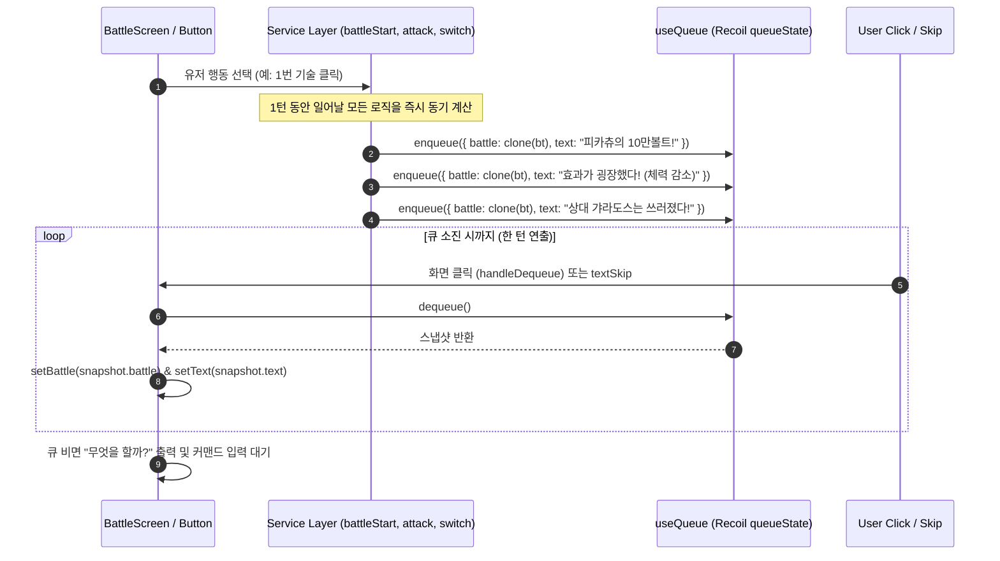
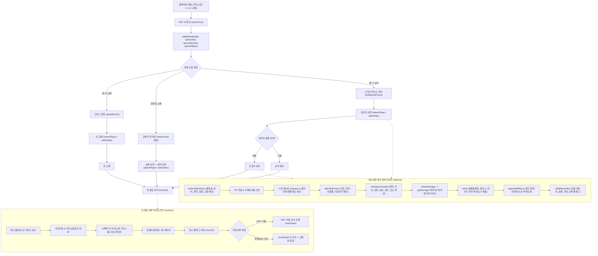

# 🎮 Pokemon Battle Simulator - 전체 아키텍처 & 플로우 가이드 (ARCHITECTURE.md)

이 문서는 본 프로젝트의 **화면 구성(UI)**, **전체 게임 플로우(Game Flow)**, **핵심 상태 관리(Queue System)**, 그리고 **각 엔티티 및 함수 간의 상관관계**를 한눈에 파악하고 이후 기능 추가/리팩토링/디버깅 시 즉시 참조할 수 있도록 정리한 시스템 설계 문서입니다.

---

## 1. 📌 시스템 개요 및 기술 스택

- **프로젝트 성격**: 6세대~9세대 기반의 포켓몬스터 3v3 싱글 배틀 시뮬레이터 (웹 기반 턴제 RPG)
- **주요 기술 스택**:
  - **Core**: React 18 (Create React App), JavaScript (ES6+)
  - **State Management**: Recoil (`queueState`, `logState`를 활용한 이벤트 스냅샷 큐)
  - **Styling**: `styled-components`, CSS 애니메이션
  - **Routing**: `react-router-dom` (v7)
  - **Testing**: Jest (`src/util/typeEffectCalculate.test.js`, `src/util/damageCalculate.test.js`, `src/entity/Ability.test.js`)

---

## 2. 🖥️ 화면 구성 (Screen & UI Hierarchy)

배틀 화면은 닌텐도 DS/3DS 스타일의 **상단 화면(배틀 필드 및 애니메이션)**과 **하단 화면(커맨드 입력 및 상태 확인)**의 2분할 구조를 가집니다.

```
[App.js]
  ├── [/]       RandomScreen (엔트리 3마리 선출 및 배틀 시작)
  └── [/battle] BattleScreen (메인 배틀 화면)
                  ├── TOP (43vh: 배틀 필드)
                  │     ├── PokemonImage (아군/적군 스프라이트)
                  │     ├── ItemImage (장착 아이템 시각화)
                  │     └── PokemonInfo (체력바 HpBar, 레벨, 랭크/상태이상 뱃지)
                  └── BOTTOM (57vh: 커맨드 패널 - bottom 상태값에 따라 렌더링)
                        ├── bottom === "skill"      -> BottomSectionSkill (기술 4종 선택, 상성 힌트, 텍스트창)
                        ├── bottom === "switch"     -> BottomSectionSwitch (벤치 포켓몬 수동 교체)
                        ├── bottom === "mustSwitch" -> BottomSectionSwitch (기절 시 강제 교체)
                        ├── bottom === "uturn"      -> BottomSectionSwitch (유턴/볼트체인지 후 교체)
                        ├── bottom === "info"       -> BottomSectionInfo (포켓몬 상세 스탯 및 스킬 정보)
                        └── bottom === "field"      -> BottomSectionField (날씨, 필드 지형, 벽, 트릭룸 상태)
```

### 주요 컴포넌트 역할
1. **`PokemonInfo` (`src/component/Top/PokemonInfo.js`)**
   - 포켓몬 이름, 레벨, 남은 체력 수치 및 `HpBar` 렌더링
   - 화상, 마비, 독, 수면, 동빙 등 상태이상 아이콘 표기
   - 랭크업/랭크다운(+1~+6, -1~-6) 상태 실시간 뱃지 출력
2. **`BottomSectionSkill` (`src/component/Bottom/Bottom-Skill/Bottom-Skill.js`)**
   - 4개 기술 버튼(`SkillButton`) 렌더링
   - 상대 포켓몬의 방어 상성을 실시간 계산(`getTypeEffectText`)하여 버튼 하단에 `◎ 굉장함`, `○ 보통`, `△ 별로`, `✕ 없음` 표기
   - 스킵 버튼(`textSkip`), 로그 모달(`LogModal`), 교체(`switch`), 정보(`info`), 필드(`field`) 전환 버튼
3. **`BottomSectionSwitch` (`src/component/Bottom/Bottom-Switch/Bottom-Switch.js`)**
   - 선출 포켓몬 3마리(`BenchPokemon`)의 체력, 상태이상, 기절 여부 출력
   - 상황에 따른 3가지 분기:
     - `switch`: 일반 행동으로 교체를 선택한 경우 (`battleStart` 호출)
     - `mustSwitch`: 포켓몬 기절 후 후속 포켓몬 선택
     - `uturn`: 유턴/볼트체인지 발동 후 교체 및 후속 턴 연결

---

## 3. 🔄 핵심 아키텍처: 스냅샷 큐(Snapshot Queue) 시스템

턴제 콘솔 게임 특유의 **"메시지 한 줄씩 출력 -> 체력바 깎임 -> 기절 처리 -> 후속 텍스트"** 연출을 비동기 React 웹 환경에서 구현하기 위해 **이벤트 스냅샷 큐** 패턴을 사용합니다.



- **`cloneWithMethods.js`**: 순수 JSON 복사와 달리 포켓몬 클래스의 메서드(`rankUp`, `getDamage`, `recover` 등)를 온전히 보존하는 커스텀 깊은 복사 함수.
- **`textFreeze`**: `"누구로 교체할까?"` 같은 사용자 선택이 필요한 특정 프롬프트 상태에서는 화면 클릭으로 큐가 넘어가지 않도록 잠금.

---

## 4. ⚔️ 배틀 턴 라이프사이클 (Full Battle Lifecycle Flow)

전체 1턴의 실행 흐름과 함수 호출 순서는 다음과 같습니다:



---

## 5. 🧩 프로젝트 디렉토리 구조 및 핵심 모듈 매핑

```
src/
├── screen/                 # 화면 단위 컴포넌트
│   ├── RandomScreen.js     # 초기 랜덤 팀 매칭 및 라우팅
│   └── BattleScreen.js     # 배틀 뷰, 상단/하단 조립, 큐 이벤트 구독
│
├── component/              # UI 세부 컴포넌트
│   ├── Top/                # 상단 필드 (스프라이트, 포켓몬 정보창, 아이템)
│   └── Bottom/             # 하단 커맨드 패널 (기술선택, 교체, 세부정보, 필드상태)
│
├── service/                # 턴 진행 오케스트레이션 및 배틀 비즈니스 로직
│   ├── battleStart.js      # 턴 진입점: 행동 우선순위 판정 및 공격/교체 분기
│   ├── attack.js           # 공격자/방어자 설정 및 skillUse 호출
│   ├── skillUse.js         # 기술 사용 파이프라인 (검사 -> 시전 -> 데미지 -> 부가효과)
│   ├── skillCheck.js       # 시전 전/후 실패 조건 판정 (풀죽음, 마비, 방어, 기습 등)
│   ├── skillEffect.js      # 기술의 랭크변화, 상태이상, 유턴 등 부가효과 적용
│   ├── onHit.js            # 접촉기 피격 시 특성/도구 발동 (까칠한피부, 정전기, 울멧)
│   ├── switch.js           # 포켓몬 교체 처리 및 등장 특성/필드 효과 트리거
│   ├── turnEnd.js          # 턴 종료 처리 (날씨/지형 카운트, 상태이상 딜, 후속교체)
│   └── field.js            # 장판 데미지 (스텔스록, 독압정) 적용
│
├── entity/                 # 도메인 데이터 모델 & 클래스
│   ├── Battle.js           # Battle 객체 생성 및 턴/필드 상태 소유
│   ├── Ability.js          # 특성 정의 및 등장 특성 발동(applyAbilityEffects)
│   ├── Item.js             # 지닌물건 데이터 및 분류
│   ├── Pokemon/            # 포켓몬 생성기 및 메서드 (rankUp, getDamage, recover 등)
│   ├── Skill/              # 기술 데이터베이스, 발동 조건, 효과 정의
│   └── Field/              # 날씨(Weather), 지형(Terrain), 룸(Room), 진영벽(UserField)
│
├── function/               # 순수 연산 보조 함수
│   ├── damage.js           # attackDamage (실제 HP 감소 및 탈/대타출동 처리)
│   ├── rankStat.js         # 랭크 배율 계산 및 랭크 변동 로직
│   ├── statusCondition.js  # 상태이상 판정 함수
│   └── switchPokemon.js    # Battle 객체 내 포켓몬 교체 스왑 로직
│
├── npc/                    # 인공지능 (NPC 의사결정)
│   ├── npc.js              # NPC 행동 최종 결정 엔트리
│   ├── npcCommon.js        # 사용 가능한 유효 행동(스킬/교체) 필터링
│   └── ai/
│       ├── easy.js         # 데미지 기댓값 및 상성 기반 지능형 판단
│       └── random.js       # 무작위 선택기
│
└── util/                   # 공통 유틸리티 및 전역 상태
    ├── recoilState.js      # queueState, logState 정의
    ├── useQueue.js         # enqueue, dequeue 등 큐 조작 훅
    ├── cloneWithMethods.js # 메서드 포함 깊은 복사 유틸
    ├── damageCalculate.js  # 포켓몬 본가 데미지 공식 계산기
    ├── typeEffectCalculate.js # 18개 타입 상성 매트릭스 및 계산
    └── speedCheck.js       # 우선도 및 스탯 기반 선공/후공 판정
```

---

## 6. 📊 핵심 함수 및 데이터 상관관계 매트릭스

| 함수명 | 위치 | 호출 주체 | 핵심 역할 및 영향받는 상태 |
| :--- | :--- | :--- | :--- |
| `battleStart` | `src/service/battleStart.js` | `BattleScreen`, `Bottom-Switch` | 턴 시작 시 행동 우선순위를 정하고 `attackPlayer`, `attackNpc`, `switchPlayer`, `switchNpc` 분기 호출 후 `turnEnd` 호출 |
| `skillUse` | `src/service/skillUse.js` | `attack.js` | 기술 시전의 전 과정(PP 소모, 명중 체크, 데미지 처리, 부가효과)을 순차적으로 수행하고 큐에 스냅샷 저장 |
| `damageCalculate` | `src/util/damageCalculate.js` | `skillUse.js`, `npc/ai/easy.js` | 공격/방어 스탯, 랭크, 아이템, 특성, 날씨, 필드, 자속, 타입상성, 급소, 난수를 반영하여 최종 데미지 산출 |
| `typeCheckOnBattle` | `src/util/typeEffectCalculate.js` | `damageCalculate.js`, `skillUse.js` | 순수 타입 상성에 부유, 풍선, 심안 특성 등을 조합하여 실제 배틀 배율(0배, 0.5배, 1배, 2배, 4배) 계산 |
| `attackDamage` | `src/function/damage.js` | `skillUse.js` | 계산된 데미지를 포켓몬에 입히며, '탈(Disguise)', '대타출동', '기합의띠' 등 방어 메커니즘 처리 |
| `applyAbilityEffects`| `src/entity/Ability.js` | `BattleScreen`(시작시), `switch.js` | 포켓몬 등장 시 발동하는 특성(위협, 불요의검, 가뭄, 잔비, 트레이스 등)을 실행하고 큐에 텍스트 등록 |
| `turnEnd` | `src/service/turnEnd.js` | `battleStart.js`, `Bottom-Switch.js` | 날씨/지형 감소, 먹밥/희망사항 회복, 화상/독 데미지, 기절 판정 후 NPC 후속 교체 또는 `mustSwitch` 트리거 |
| `npcChoice` | `src/npc/npc.js` | `BattleScreen`, `Bottom-Switch` | NPC가 현재 배틀 상태에서 가장 적절한 기술 또는 교체 행동을 결정 |

---

## 7. 🛠️ AI 개발 어시스턴트용 작업 치트시트 (개발 시 필수 주의사항)

1. **상태 불변성과 메서드 보존 (`cloneWithMethods`)**:
   - `queueObject.enqueue`를 호출할 때 반드시 객체의 프로토타입과 메서드가 유지되어야 합니다. 일반 `JSON.parse(JSON.stringify())`를 쓰면 `pokemon.rankUp` 같은 함수가 유실되어 런타임 크래시가 발생합니다.
2. **배틀 이벤트 텍스트 큐 등록**:
   - 로직 내부에서 `battle`의 값을 직접 바꾸더라도 `enqueue({ battle, text })`를 호출하지 않으면 UI 상단 텍스트와 체력바에 반영되지 않습니다.
3. **유턴 / 볼트체인지 예외 처리**:
   - 유턴 기술 사용 시 공격 후 턴이 종료되지 않고 `battle.turn.uturn = true`가 되며, UI가 `bottom === "uturn"` 화면으로 전환되어 사용자가 교체 대상을 골라야 다음 턴 루틴(`attackNpc` 또는 `turnEnd`)이 이어집니다.
4. **동시 기절 (Double Faint)**:
   - 양측 포켓몬이 목숨걸기나 반동 등으로 동시 기절했을 경우, 플레이어가 먼저 `mustSwitch`로 후속 포켓몬을 고른 뒤 `Bottom-Switch` 내부에서 NPC 후속 포켓몬 교체(`switchNpc`)가 순차 호출되어야 합니다.
5. **테스트 스위트 관리**:
   - 순수 로직 변경 시 `npm run test -- --watchAll=false`로 단위 테스트 깨짐 여부를 상시 점검합니다.
